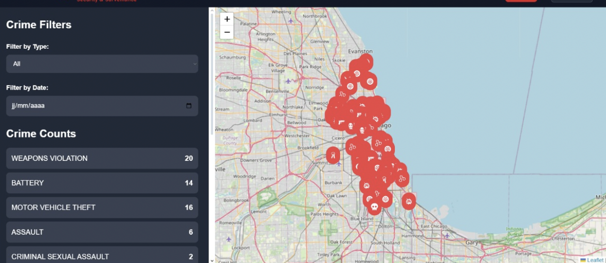
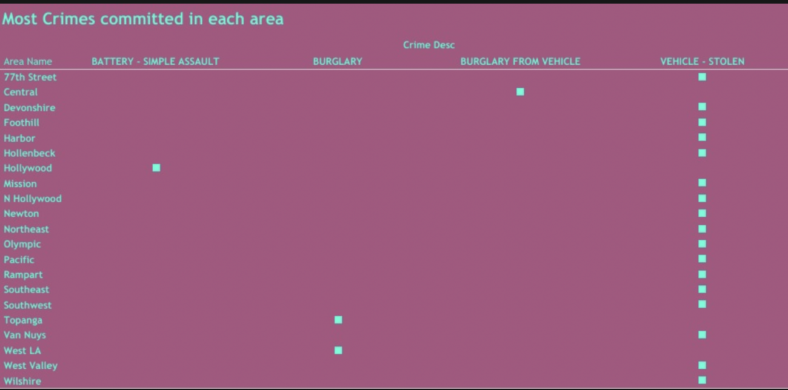
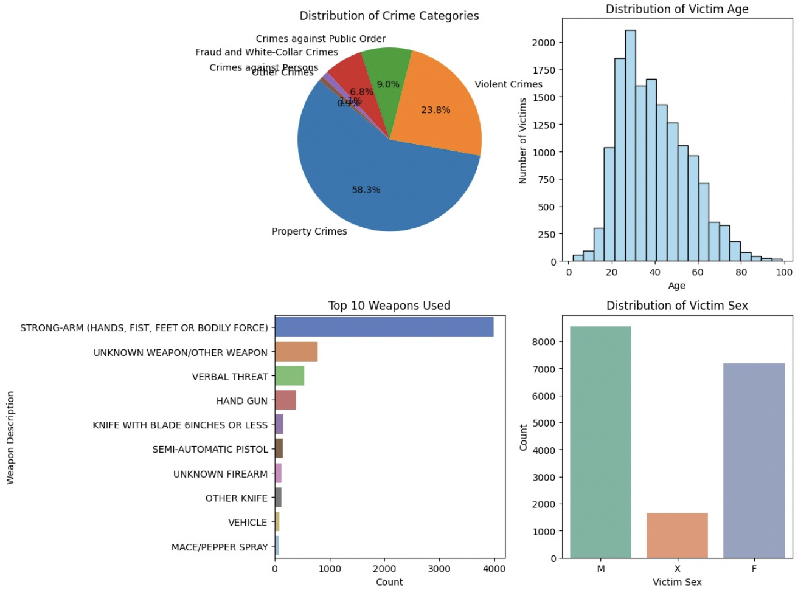
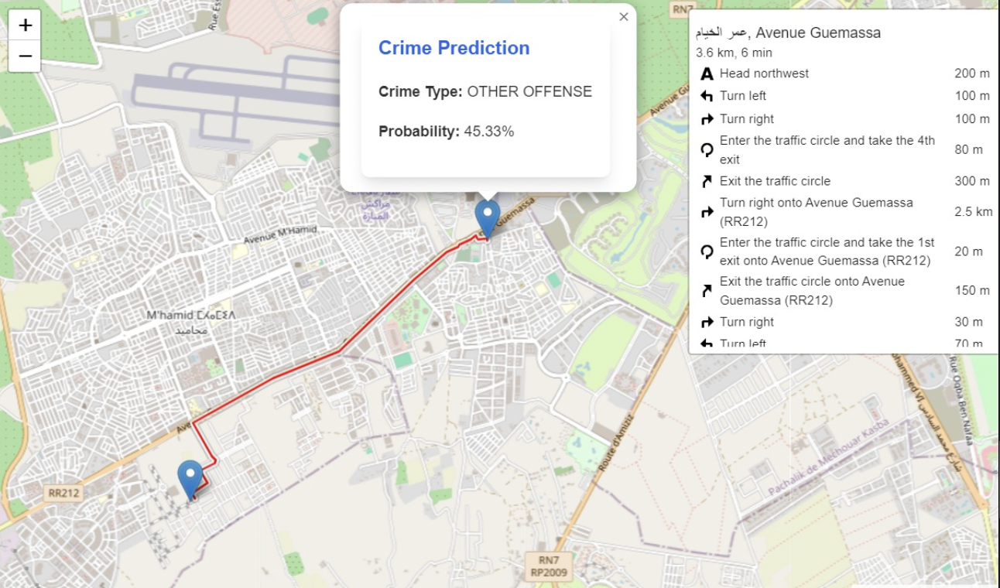
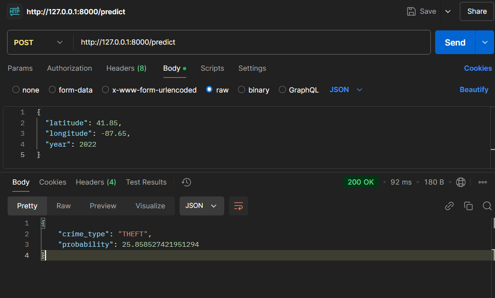

# AnomalieDetection

## Description

**AnomalieDetection** est un projet innovant qui combine des technologies de Machine Learning et des visualisations interactives pour détecter des anomalies géospatiales, principalement des crimes. Ce projet offre deux solutions principales :

1. **CrimeDetectionModel-web** : Une application web basée sur React permettant d'analyser et de visualiser les données d'anomalies.
2. **AnomalieDetection-mobile** : Une application mobile Flutter pour une détection en temps réel.

---

## Fonctionnalités principales

### 1. Visualisation interactive
Une carte interactive affiche les anomalies détectées avec des marqueurs et des filtres permettant de trier les données par type ou date.



---

### 2. Analyse régionale
Les crimes sont regroupés par zones géographiques pour offrir une vue claire des types de crimes les plus fréquents.



---

### 3. Statistiques détaillées
Des graphiques interactifs fournissent des informations complètes sur :
- La répartition des types de crimes.
- Les caractéristiques des victimes (âge, sexe).
- Les armes utilisées.



---

### 4. Prédiction avec itinéraire
L'application fournit des prédictions en temps réel pour des itinéraires spécifiques, en indiquant le type de crime probable et sa probabilité.



---

### 5. Prédictions via API
Grâce à une API Flask, les utilisateurs peuvent soumettre des requêtes pour obtenir des prédictions sur des coordonnées GPS spécifiques.

**Exemple d'une requête POST via Postman :**


---

## Structure du projet

### 1. CrimeDetectionModel-web
- **backend/** : API Flask pour gérer les prédictions et données.
- **frontDetection/** : Interface utilisateur développée en React.
- **notebooks/** : Scripts Jupyter Notebook pour l'analyse des données et l'entraînement des modèles.
- **screenshots/** : Captures d'écran illustrant les fonctionnalités principales.

### 2. AnomalieDetection-mobile
- **flutter_anomalie_detection/** : Code source de l'application mobile Flutter.

---

## Installation

### Prérequis
- **Python 3.7+** : Pour exécuter le backend Flask et les notebooks.
- **Node.js** et **npm** : Pour le frontend React.
- **Flutter** : Pour l'application mobile.

### Étapes d'installation

#### Pour CrimeDetectionModel-web
1. Clonez le dépôt :
    ```bash
    git clone https://github.com/votre-utilisateur/CrimeDetectionModel-web.git
    cd CrimeDetectionModel-web
    ```

2. Configurez le backend Flask :
    ```bash
    cd backend
    pip install -r requirements.txt
    python app.py
    ```

3. Configurez le frontend React :
    ```bash
    cd frontDetection
    npm install
    npm start
    ```

4. Lancez les notebooks Jupyter (optionnel) :
    ```bash
    cd notebooks
    pip install -r requirements.txt
    jupyter notebook
    ```

#### Pour AnomalieDetection-mobile
1. Clonez le dépôt :
    ```bash
    git clone https://github.com/votre-utilisateur/AnomalieDetection-mobile.git
    cd flutter_anomalie_detection
    ```

2. Installez les dépendances et lancez l'application :
    ```bash
    flutter pub get
    flutter run
    ```

---

## Remerciements

Merci à tous les contributeurs et à la communauté open-source pour leurs outils précieux, tels que Python, React, Flutter, Flask, et Jupyter.

---

## Licence

Ce projet est sous licence MIT. Consultez le fichier `LICENSE` pour plus d'informations.
